# Ansible Account Platform

AWS 계정 관리 통합 포털 — http://52.40.59.142/

## 아키텍처

```
[Frontend (React+Vite)] → [Nginx (80/443)]
                              ├── /api/cost-monitoring → backend-cost (별도 저장소)
                              └── /api/*               → [backend-admin :5000]
                          [Redis 7 (캐시)]
                          [Ansible (계정 자동화)]
```

## 구동 서비스 (Docker Compose)

| 컨테이너 | 이미지 | 역할 |
|----------|--------|------|
| userportal-nginx | nginx:alpine | 리버스 프록시 (HTTP/HTTPS) |
| userportal-backend-admin | account-portal-backend-admin | 계정/SSO/GitHub/온보딩 API |
| userportal-redis | redis:7-alpine | 캐시 (256MB, allkeys-lru) |

## 디렉토리 구조

```
account-portal/
├── backend-admin/          # Flask API
│   ├── routes/             # accounts, auth, sso, onboarding, github, instances 등
│   ├── services/           # github_service
│   ├── data/               # mappings, 스크립트
│   └── Dockerfile
├── frontend/               # React + Vite + Tailwind
│   ├── src/pages/          # CreateAccount, Login, Onboarding, GitHubTeams 등
│   ├── src/components/     # Layout, Sidebar
│   ├── .env                # Cognito 설정
│   └── package.json
├── nginx/                  # nginx 설정 + SSL 인증서
└── docker-compose-fixed.yml

ansible/
├── regions/                # 리전별 playbook
│   ├── us-east-1/          # 계정 생성/삭제, 역할 변경, sudoers
│   └── us-west-2/          # 계정 생성/삭제, sudo 관리
├── roles/                  # identity_center, ssm
├── docker/                 # Ansible 실행 컨테이너
├── scripts/                # ssm_sudo.sh
├── ssm_automation/         # SSM 자동화 문서
├── cost_monitoring/        # 비용 에이전트 배포 (Ansible playbook)
├── check_user.yml
├── create_sso_user.yml
├── integrated_provisioning.yml
└── onboarding_provisioning.yml
```

## 환경변수

### backend-admin
| 변수 | 값 |
|------|-----|
| AWS_DEFAULT_REGION | us-west-2 |
| SES_SENDER_EMAIL | mogam.infra.admin-noreply@mogam.re.kr |
| SES_APPROVER_EMAIL | changgeun.jang@mogam.re.kr |
| SES_REGION | us-east-1 |

### frontend (.env)
| 변수 | 설명 |
|------|------|
| VITE_COGNITO_DOMAIN | Cognito 도메인 |
| VITE_COGNITO_CLIENT_ID | Cognito 클라이언트 ID |
| VITE_COGNITO_REDIRECT | 인증 콜백 URL |

## 실행

```bash
cd /home/app/account-portal
docker compose -f docker-compose-fixed.yml up -d --build
```

---

## 포털 기능 상세 (스크린샷)

### I. 계정 관리 및 프로젝트 권한 제어

#### 01. 포털 사용자 관리

포털 사용자 리스트를 조회하고 역할/페이지 접근 권한을 확인합니다.

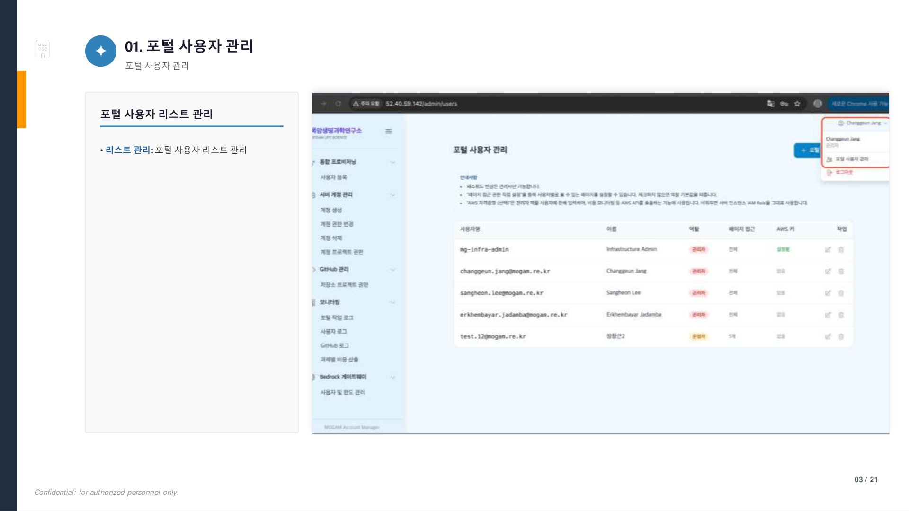

#### 02. 포털 사용자 관리 상세

신규 사용자 추가, 비밀번호 설정, 역할(운영자/관리자 등) 및 페이지별 접근 권한을 직접 설정합니다.

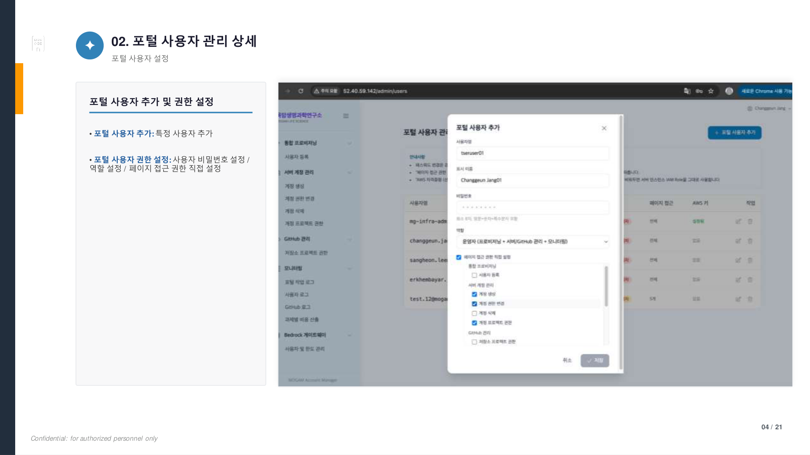

#### 03. 통합 프로비저닝 (Onboarding)

원클릭으로 이메일·서버 계정 매핑, AWS IAM Identity Center 추가 및 앱 할당을 수행합니다. Infra Manager / Researcher IAM 그룹 자동 배치 및 Dry Run 검증을 지원합니다.

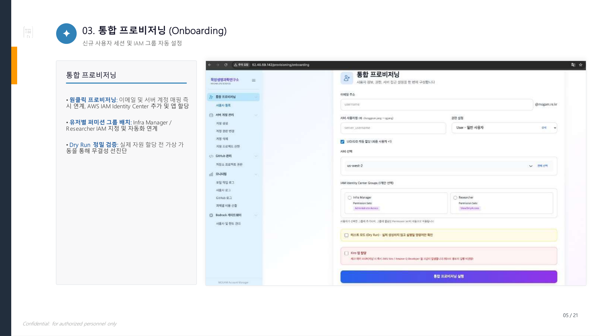

#### 04. 서버 계정 생성

GPU 인스턴스별 원스톱 계정 생성. 가동 리전 및 대상 인스턴스를 선택하여 원클릭 발급합니다.

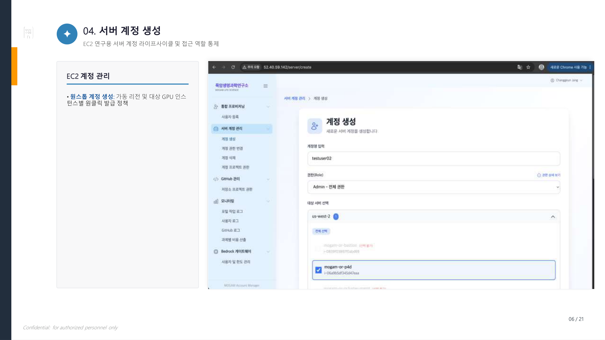

#### 05. 서버 계정 권한 변경

User(읽기) / Ops(운영) / Admin(전체) 역할을 다중 계정에 일괄 적용합니다.

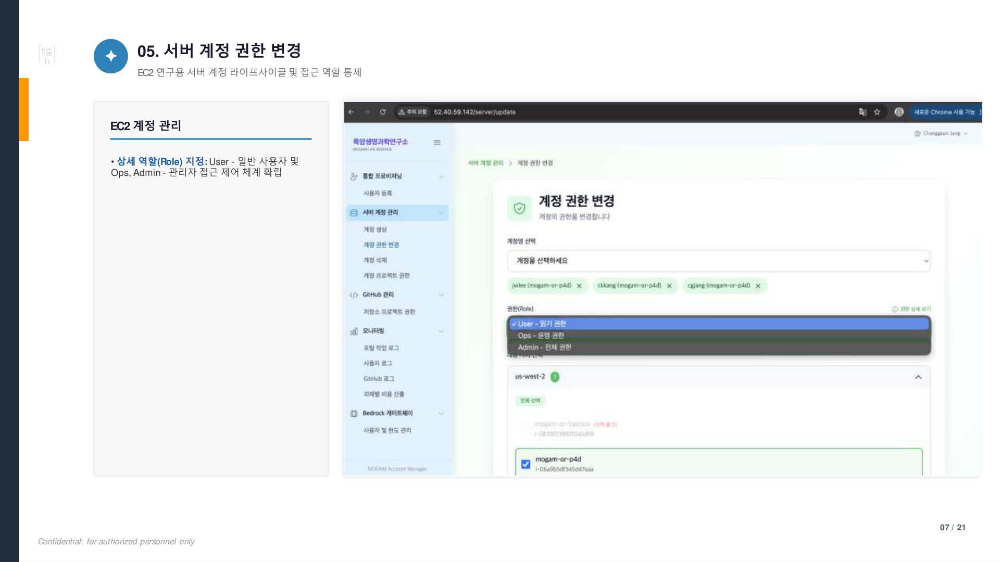

#### 06. 서버 계정 삭제

만료 계정을 즉각 회수하고 변동 사항을 실시간 반영합니다.

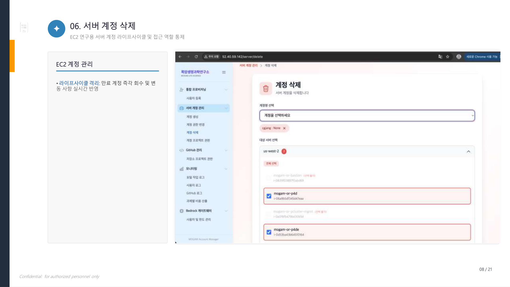

#### 07. 서버 계정 프로젝트 권한

과제 영역별 인스턴스 그룹 분리 매핑 및 사용자 연동 배치 (Candidate_Antibody, Candidate_CVI 등). 비인가 사용자의 연구망 접근을 통제합니다.

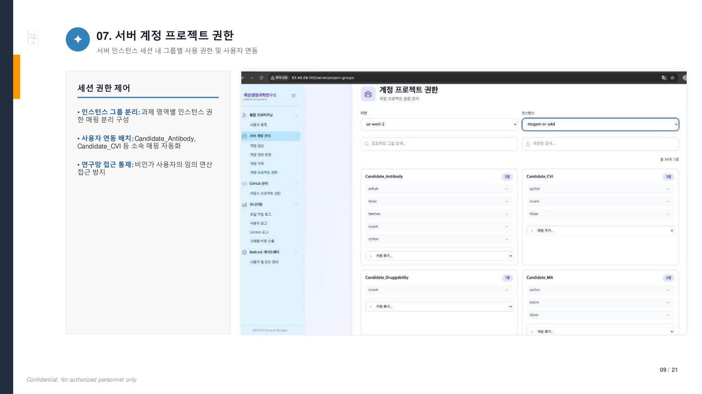

#### 08. 저장소 프로젝트 권한

프로젝트 리포지토리별 팀 바인딩, 쓰기 정책(Write) 무단 푸시 방지, 접근 통제 승인으로 소스코드 변형 이력을 추적합니다.

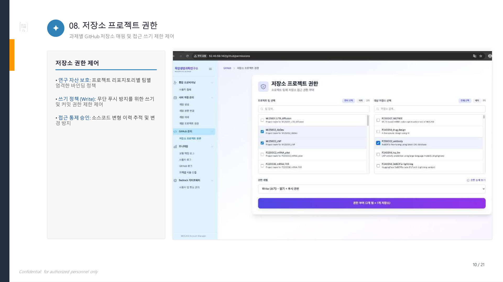

---

### II. 세션 명령어 감사 및 자원 비용 통제

#### 09. 포털 작업 로그 조회

계정 추가·권한 수정 등 관리 조작을 실시간 이력으로 저장합니다. 작업 일자, 계정, 작업 유형별 필터링을 지원합니다.

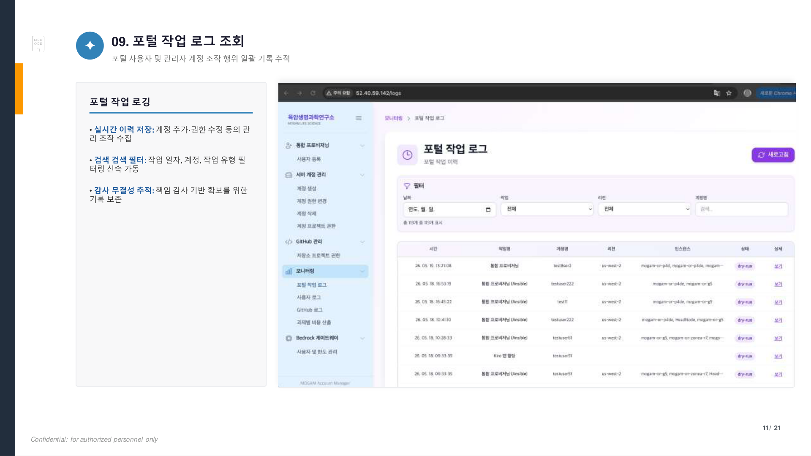

#### 10. 포털 작업 로그 상세

조작 이력 터치 시 세부 구동 파라미터 팝업 — Ansible 결과 로그, 인스턴스 ID, 실행 상태(dry-run/실행됨) 등을 확인합니다.

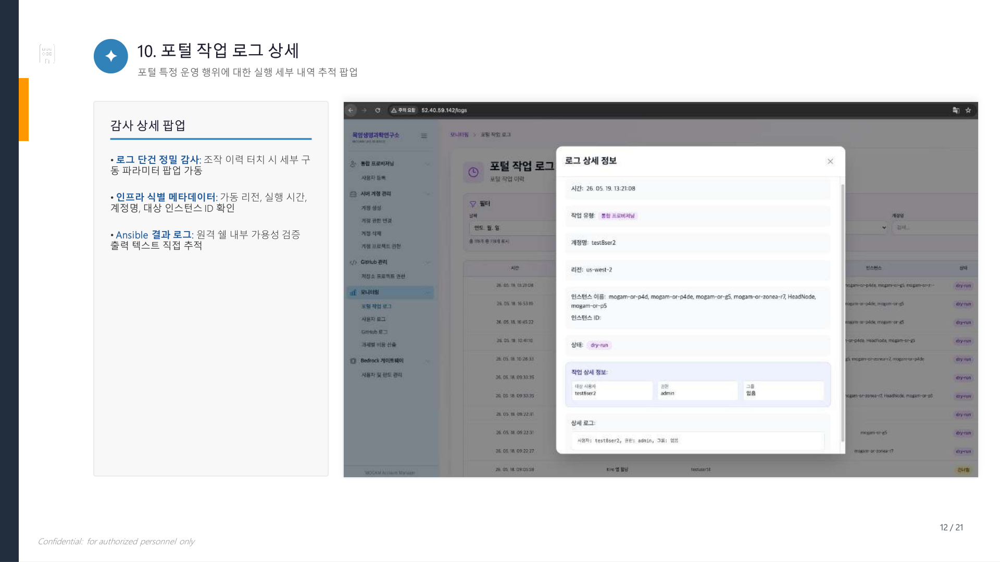

#### 11. 사용자 명령 로그 조회

EC2 터미널 세션 내 크리티컬 실행 커맨드(rm, docker 등) 전수 모니터링. 인스턴스, 계정명, 실행 날짜별 빠른 검색이 가능합니다.

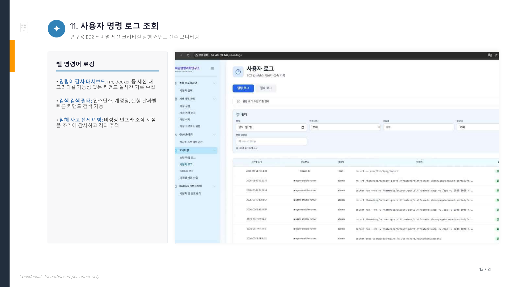

#### 12. 사용자 명령 로그 상세

명령어 실행 단건의 접속 소스 IP, 가상 터미널, 작업 디렉토리, 실행 결과(Exit Code)까지 감사 디테일 모달로 제공합니다.

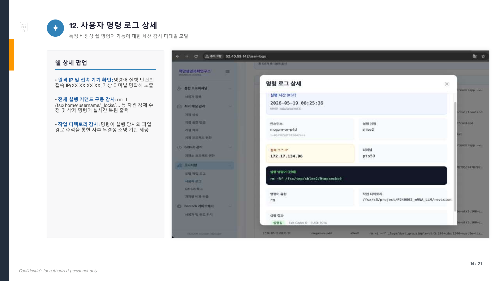

#### 13. 사용자 접속 로그 조회

EC2 인프라 원격 접속 세션을 시간별 타임라인으로 감사합니다. 비승인 외부 네트워크 로그인 이상 원천 감지 및 인적 보안 책임 보장을 위한 기록입니다.

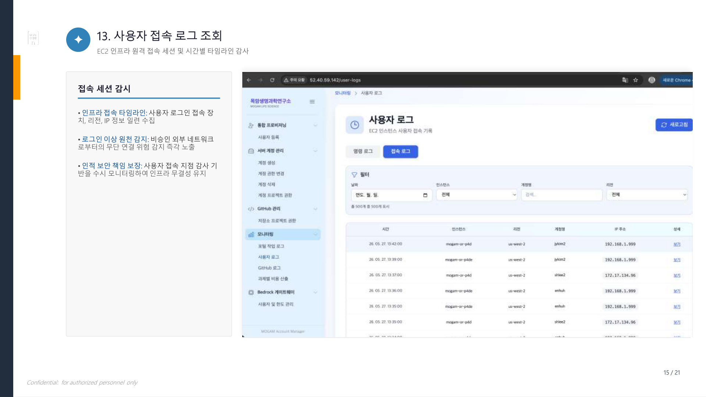
